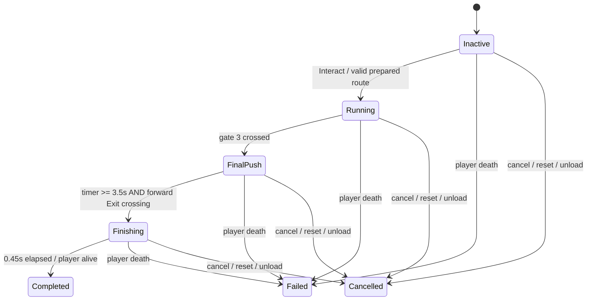

# Corridor V2 — production migration specification

Статус: проект для подтверждения. Дата: 2026-10-07. Основание: пользовательский запрос `f9aaf58d-4729-47b3-ac2d-2b4fe55c5cb6/Вставленный текст.txt`.

На этом шаге выполнен только статический аудит. Gameplay, assets и сцены не изменены; Unity Play Mode, Golden Path и Batch Runner не запускались. Описанные ниже изменения — будущая миграция, а не уже реализованные свойства production. Исходный HEAD: `1d00fc934fe54d6927f4c753207c0e45bb846b92`; существующие незакоммиченные изменения V2 учитываются как исходное состояние и сохраняются.

## 1. Аудит текущей системы

Все пути ниже относительно корня репозитория.

| Область | Найдено и последствия |
|---|---|
| Runtime | `Assets/_Project/scripts/World/Events/EvacuationCorridorEvent.cs`: production `WorldEvent`, движущийся прямоугольник, без gates/Exit/rockets. `WorldEvent.cs` и `WorldEventSpawner.cs` — владельцы lifecycle, pressure и reward notification. |
| Prefab / serialized references | `Assets/_Project/prefabs/Environment/WorldEvents/EvacuationCorridorEvent.prefab`, GUID `e47c3f95a8a34c18a619b70ec785f142`. Ссылки: `Scenes/MainBuild/MVP.unity:303`, `Dev/Labs/WorldSystemsLab/WorldSystemsLab.unity:6140,6303`, `Data/SurfaceMap/Sector_D1.asset:38`, `Sector_D2.asset:38`. Прямых scene instances старого component не найдено. |
| Script GUID | `e47c3f95a8a34c18a619b70ec785f141`; найден в старом prefab. Новому runtime дать новый script GUID; prefab сохранить GUID при переносе и перебиндинге component. |
| Catalog / creation | `WorldEventSpawner.cs`: обычное создание, создание внутри anomaly, `SpawnSiteEventAt` и debug spawn. `scripts/Run/Exploration/ProductionExplorationSectorController.cs:1237–1277` собирает site pool через `AllowedInSite`, применяет weights и guaranteed events. Не исключать Corridor из site pool для обхода интеграционных проблем. |
| Config / sector | Отдельного legacy Corridor SO нет: tuning сериализован в prefab. D1/D2: event frequency `1.5`, Corridor multiplier `2`. `Dev/Editor/Authoring/SurfaceMapProductionAuthoring.cs:187` определяет вес через `p is EvacuationCorridorEvent`; заменить эту проверку при cutover. |
| Route / completion | Старый runtime пробует 32 позиции и четыре cardinal направления, ограничивает начало и конец своим site rectangle. Root перемещается со скоростью `1.5` на расстояние `10`; достижение root endpoint запускает fade, затем completion (`EvacuationCorridorEvent.cs:142–164,292–302,443–451`). Прохождение игроком Exit не требуется. |
| Procedural geometry / presentation | Awake добавляет trigger BoxCollider2D; код создаёт start fill, LineRenderer outline на 48 точек и quad MeshRenderer для outside darkness. Отдельного старого Corridor HUD нет; используются общие marker/run messages. Старый prefab практически root с CircleCollider2D и event component. |
| Materials / shader | `art/mat/WorldRules/M_EvacuationCorridor.mat`, GUID `60a86a73f1bb434fa6c0ba457b9b3e33`, используется только старым prefab; `Shaders/EvacuationCorridor.shader`, GUID `57cbf95ee3934c25ac1e09b2c11db741`, только этим material. Кандидаты на удаление после повторного поиска usages. |
| Shared FX | `prefabs/projectiles/M_LaserLine.mat`, GUID `dca396c6aa60fe549b61f941be335967`, также нужен FalseSignalPoint, FalseSignalEvent, CarrierHuntEvent и turrets. Сохранить material и shared helpers независимо от удаления старого procedural Corridor. |
| Layers / dash | Старый Corridor — trigger, физических walls нет. Player physics layer отсутствует; Player — sorting layer, Enemy имеет physics layer. `scripts/Combat/Player/CharacterMovement2D.cs:375–394` фильтрует dash hits через `source.CanContact(hit.collider)`. Нельзя использовать `LayerMask.GetMask("Player")`. |
| Rockets | Старый Corridor их не использует. `scripts/Combat/Enemies/RocketAttackRunner.cs` production-safe, без Dev guard; использует shared warning/rocket/explosion pools. `EnemyExplosion` повреждает и дедуплицирует PlayerHealth, не enemies. |
| Reward | Старый Corridor не переопределяет `CompletionReward`, не выдаёт upgrade/currency сам. Сохраняет endpoint как `RewardPosition`. `WorldEventSpawner.cs:762–794` выдаёт стандартный container или применяет site suppression; normal site использует existing upgrade-choice queue, special site — ring после двух целей. |
| Localization | `Data/Localization/LocalizationTable.asset:1387,1609–1614`: `event.evacuation`, `event.evacuation.name`, `event.evacuation.description`. Старое описание «stay within safe corridor» больше не объясняет новую механику. Не удалять другие evacuation/bunker keys по подстроке. |
| Tutorial | Прямых Corridor dependencies не найдено. `scripts/Run/Tutorial/TutorialController.cs:33,56–93,205–255` и production tutorial setup ориентированы на OrbitalRelay. `Dev/Tests/Core/Editor/Subject42TutorialTests.cs` проверяет Relay. Текущий tutorial не переориентировать на Corridor. |
| Bot / map | `Dev/Debug/GoldenPathLab/BotController.cs:107–141`: Relay priority, затем generic root/nearest Target descriptors; нет Corridor branch, записи progress или вызова DebugConfigurePath. `scripts/UI/HUD/TacticalMapHUD.cs:246–279` рисует root dot и не читает marker-provider geometry. `ITacticalMapMarkerProvider` используется bot; legacy `Corridor` kind сейчас нужен только старому event. |
| Dev dependency legacy | `EvacuationCorridorEvent.cs` выбирает `BotRunSeed.EventRandom` только под Editor/Development guard; release использует Unity Random. DebugConfigurePath также guarded. Новый runtime не должен сохранять ссылку на BotRunSeed. |
| Player position | Старый event перемещает свой root, не игрока. В audited `WorldEvent`, spawner, sector/site completion не найден автоматический reposition. Lab teleport/revive/arena expansion — bootstrap, не production behavior. |

### Lifecycle и системные ограничения

`WorldEvent.cs:156–184`: Complete вызывает cleanup, уведомляет owner и уничтожает root; Fail вызывает cleanup и уведомляет owner, но root сам не уничтожает. Cancel по умолчанию — Fail. Owner reset (`208–224`) выполняет cleanup без результата/награды. `WorldEventSpawner.cs:100–122` освобождает spawned events при scene cleanup.

Одновременно start разрешён одному WorldEvent (`WorldEventSpawner.cs:710–718`), но anomaly effects не являются такими events. Overlap event + territory уже поддерживается: spawner умеет ставить origin внутри anomaly (`252–325`). Увеличивать число активных WorldEvents для этой миграции не требуется.

**Конфликт lifecycle:** `ProductionAnomalySite.cs:541–576` завершает site после события/settlement reward queue; `CompleteSite:653–659` вызывает `CollapseEnvironment:628–645`, который удаляет anomaly zone через `LevelAnomalyController.cs:410–417`. Даже безопасный Corridor cleanup косвенно удалил бы свою site anomaly. Это требует изменения orchestration, описанного в §6.

**Конфликт placement:** текущий footprint spawner учитывает только CircleCollider2D (`357–392`). Длинные route boxes ему невидимы. Старое полное ограничение site rectangle несовместимо с проходом через соседние территории. В MVP authored PlayableArea имеет размер 100×100; Straight V2 имеет длину 129 без учёта caps. Нельзя молча уменьшить route или расширить production world. Проверка ведётся по фактическому runtime PlayableArea; Straight сохраняется в configs и доступен только там, где помещается.

**Death:** V2 проверяет смерть только в Update при ненулевом timeScale. `PlayerHealth.cs:121–140` останавливает run, но `RunFlowController.StopRunGameplay` не завершает WorldEvents. Новая версия должна получать death notification независимо от scaled Update.

## 2. Production current vs V2

| Пункт | Production current | WorldSystemsLab V2 | Решение |
|---|---|---|---|
| Route generation | Moving rectangle, random direction / site-contained start/end | Authored Straight/L/Zigzag; seeded cardinal Random; 90° root rotation | Заменить; адаптировать placement под весь route и world bounds |
| Checkpoints | Нет | Три последовательных forward-plane crossings | Переиспользовать математическое crossing; отделить mutable progression |
| Exit | Автоматический arrival root | Locked → Final Push → Open; физическое crossing | Заменить |
| Collapse | Damage вне движущегося rectangle | Route-distance front, periodic pressure, Final Push acceleration | Заменить; удалить old darkness/damage |
| Strikes | Нет | SINGLE / SIDE GAP / CROSS BLOCK / CHASE через shared runner | Переиспользовать scheduler и shared assets; сохранить non-lethal |
| Enemy interaction | Trigger, enemies не блокируются | Wall overrides блокируют player, пропускают enemies | Адаптировать и проверить walk/dash в production |
| Anomaly overlap | Event inside anomaly допустим; site success удаляет territory | F9 независимая territory; owned-only cleanup | Адаптировать site lifecycle; переиспользовать anomaly mechanics |
| Player completion position | Player не телепортируется, root перемещается | Player остаётся у Exit; .45s finish | Сохранить отсутствие reposition и короткую finishing фазу |
| Rewards | Spawner / site owners, endpoint position | Lab completion без production economy | Переиспользовать production policy, адаптировать endpoint |
| HUD | Общие messages/marker | Authored compact HUD, English strings | Перенести view, локализовать; удалить debug wording |
| Prefabs | Root + procedural visuals | Kit segments/corners/caps/gates/exit/front/trail/HUD | Заменить legacy hierarchy, перенести Kit с GUID |
| Cleanup | WorldEvent cleanup, own darkness/trigger | Owned modules + runner dispose | Переиспользовать ownership; усилить terminal/death handling |
| Tutorial | Relay, без Corridor dependencies | Lab controls/instructions | Сохранить Relay; добавить generic objective guidance |
| Bot support | Generic root seeking | Нет production navigation integration | Адаптировать read-only ordered navigation/safety |

## 3. Финальная class structure и контракты

Production runtime: `Assets/_Project/scripts/World/Events/Corridor/`. Без Editor/Development guards и ссылок на Dev.

| Файл / тип | Ответственность |
|---|---|
| `CorridorEvent.cs` | WorldEvent adapter: prepare placement, initialize actors/config, lifecycle, reward endpoint, notifications. Не содержит generation, strike patterns или построение UI. |
| `CorridorRuntimeState.cs` | Единственный writer фазы, ordered checkpoint count и Final Push/finish timers. |
| `CorridorRoute.cs` | Immutable route geometry: anchors, distances, Sample/Project, segments, crossing planes. Не хранит completed count. |
| `CorridorRouteDefinition.cs` | SO authored preset anchors, reference lengths, corner inset. |
| `CorridorConfig.cs` | SO tuning, default mode, preset refs, seed input policy, shared rocket refs, Kit. |
| `CorridorRouteBuilder.cs` | Компактный pure builder для authored presets и существующего bounded cardinal Random алгоритма. Не система генерации уровней. |
| `CorridorGate.cs` | Pure swept forward-plane crossing одного gate; ordinal хранится в route. |
| `CorridorExit.cs` | Gameplay crossing Exit, разрешён только после всех gates и открытия. |
| `CorridorCollapse.cs` | Front distance, pressure predicate, damage interval; без renderer и anomaly ownership. |
| `CorridorStrikes.cs` | Четыре patterns и scheduler; owns RocketAttackRunner. |
| `CorridorPresentation.cs` | Instantiate/bind authored modules, HUD snapshot, visual phases, wall overrides, idempotent disposal. |
| `CorridorNodeView.cs`, `CorridorHudView.cs`, `CorridorKit.cs` | Authored references; visual state switching; Kit SO. Нет gameplay progression в views. |
| `CorridorPlacement.cs` | Whole-route validation и bounded candidate admission; статические препятствия, playable bounds, start/site/exit safety. |
| `ICorridorNavigation.cs`, `CorridorNavigationSnapshot.cs` | Read-only route/current target/front/strike threats для dev bot. Нет методов изменения progression. |

Минимальные интеграционные файлы вне папки: `WorldEventPlacementContext.cs`, generic hooks в WorldEvent/spawner, `SiteEnvironmentCompletionPolicy.cs`, generic objective guidance contract `IWorldEventObjectiveProvider.cs`. Не вводить общий framework маршрутов/мини-игр.

Основные интерфейсы:

```csharp
// WorldEvent: default hook succeeds and preserves existing events.
public virtual bool TryPreparePlacement(WorldEventPlacementContext context, out string error);
public virtual SiteEnvironmentCompletionPolicy EnvironmentCompletionPolicy { get; }
// Context: Origin, actual PlayableArea, optional SiteStartBounds, Seed;
// IsStaticFootprintClear(Rect footprint) delegates existing obstacle/safety rules.

public static bool CorridorRouteBuilder.TryBuild(CorridorConfig config,
    CorridorRouteMode mode, int seed, int quarterTurns, Vector2 start,
    out CorridorRoute route, out string error);
public Vector2 CorridorRoute.Sample(float distance);
public float CorridorRoute.Project(Vector2 position);
public bool CorridorGate.Crossed(Vector2 previous, Vector2 current);
public bool CorridorExit.Crossed(Vector2 previous, Vector2 current, bool isOpen);
public bool CorridorRuntimeState.TryAdvance(CorridorRoute route, Vector2 previous, Vector2 current);
public void CorridorRuntimeState.Tick(float deltaTime);
public void CorridorCollapse.Tick(float deltaTime, bool finalPush);
public bool CorridorCollapse.TryPressure(Vector2 position, float deltaTime, out float damage);
public void CorridorStrikes.Tick(float deltaTime, CorridorNavigationSnapshot snapshot, bool combatAllowed);
public void CorridorPresentation.Bind(CorridorRoute route, CorridorKit kit, int playerColliderMask);
public void CorridorPresentation.Render(CorridorNavigationSnapshot snapshot);
public CorridorNavigationSnapshot ICorridorNavigation.GetNavigationSnapshot();
```

Snapshot включает immutable route, phase, next gate ordinal, current objective position, ExitOpen, front distance и readonly strike footprints/times. Guidance contract отдаёт localization keys + world target, но не concrete Corridor type. Config validation отвергает отсутствующие assets и неверные counts до start; silent procedural fallback для отсутствующего authored preset запрещён.

## 4. State flow и ownership



Checkpoint crossing строго previous≤0 → current>0 по forward plane, внутри ширины gate (`0.65 × route half-width`), максимум один следующий checkpoint за tick, как в V2. Trigger child остаётся authored gameplay volume, но OnTriggerEnter не заменяет swept crossing. Arrival near gate, обратное crossing, пропуск gate и teleport вне допустимого swept path не дают progress. Сохранить V2 path containment sampling `.25` и maximum accepted movement `12`.

Front начинает chase после первого gate, непрерывно движется по общей distance и не сбрасывается при gate. После gate 3 идёт Final Push; Exit становится open после `3.5s`, без автоматического success по survival timer. Crossing запускает Finishing: strikes отменяются, completion pulse/SFX, через `.45s` CompleteEvent. Смерть в эти `.45s` означает Failed — намеренно сохраняется V2, а не вводится новое немедленное reward commit. Locked Exit не обязан быть физической преградой: раннее crossing не завершает event, после открытия нужен новый forward crossing.

Один terminal disposal: unsubscribe death; Dispose runner прежде presentation; немедленно disable owned colliders/HUD/FX; release owned objects, затем ровно одно lifecycle notification. Complete → existing CompleteEvent; Fail и пользовательский Cancel → existing failure notification и уничтожение root. Reset/unload → owner-reset без rewards/site success. Cancelled — отдельная внутренняя фаза. Повторный вызов безопасен. Temporary pause не terminal; отключение event root в рабочей сцене считается terminal cancel, а owner reset сначала устанавливает no-result teardown, затем деактивирует root. Scene unload не генерирует failure retry.

Добавить `PlayerHealth.Died` notification после `isDead=true`, до StopRunGameplay; Corridor подписывается при initialize и проверяет уже умершего actor. Site retry после death разрешать только при живом player и продолжающемся run. Не полагаться на scaled Update.

## 5. Assets, hierarchy и route config

Переносить assets вместе с `.meta`, не создавать production copies. Конечная структура:

```text
Assets/_Project/prefabs/Environment/WorldEvents/Corridor/
  PF_CorridorEvent.prefab                 # GUID старого production prefab
  PF_CorridorSegment_Straight.prefab
  PF_CorridorSegment_Corner.prefab
  PF_CorridorSegment_Cap.prefab
  PF_CorridorGate.prefab
  PF_CorridorExit.prefab
  PF_CorridorCollapseFront.prefab
  PF_CorridorReclaimed.prefab
  PF_CorridorHUD.prefab
Assets/_Project/Data/WorldEvents/Corridor/
  CorridorConfig.asset
  CorridorKit.asset
  Routes/CorridorStraight.asset
  Routes/CorridorL.asset
  Routes/CorridorZigzag.asset
Assets/_Project/art/WorldEvents/Corridor/   # Kit/Art PNG + SVG + meta
```

Event root — stable start anchor, authored start interaction collider/marker references + CorridorEvent/config. Runtime child instances — segments/corners/caps, Gate_0..2, Exit, CollapseFront, Reclaimed trail; HUD instance из authored prefab под существующим UI host. Никаких `new GameObject` для visual/UI tree, runtime AddComponent/mesh generation или procedural layout. Размещение, длина tiled sprite и rotation authored modules разрешены; сохранять pixel density при scaled segments.

Gate/Exit hierarchy: `Gameplay/Trigger`, `Gameplay/CrossingPlane`, `Gameplay/Forward` отдельно от `Presentation/LeftPylon`, `RightPylon`, phase FX roots. Gate inactive — dim pylons, без membrane; active — cyan pulsing energy field; completed — stable green membrane. Exit locked red / FinalPush yellow / open green. Collapse — authored curtain prefab; reclaimed — existing shared pixel reference. Нет world-space TMP debug labels. HUD — localization-bound compact authored view, не procedural панель.

Kit source: `Dev/Labs/WorldSystemsLab/CorridorKit/` (все восемь module/HUD prefabs, Kit SO, Art). Перенести Node/Hud/Kit/RouteDefinition scripts с `.meta`, переименовать в production types и снять Dev guards, чтобы сохранить serialized references. Старый lab `PF_CorridorV2Event.prefab` GUID `239249a58d52d9b41b42c64592c3a448` удалить после переключения Lab: он не является production root. Старый production prefab переместить и переписать component/hierarchy с сохранением GUID `...142`; существующие MVP/D1/D2 ссылки остаются валидными. Kit GUID `49a1b742600515043845b44a8dec90c5` также сохранить.

RouteDefinition: mode Straight/L/Zigzag, `startAnchor`, ровно три `checkpointEndAnchors`, `exitAnchor`, reference segment length `35`, exit length `24`, corner inset `2`. Config: mode Random по умолчанию; width `8`, checkpoint count `3`, segment length `35`, exit extension `24`; references на три authored definitions. Runtime route — immutable vertices + cumulative distances + ordered gate planes; cardinal rotation применяется один раз, затем translate так, чтобы local start совпал с admission origin.

Random: сохранить V2 seeded System.Random, cardinal bounded backtracking budget `2048`, rejection U-turn/self-overlap и deterministic monotonic-stair fallback при исчерпании бюджета. Это алгоритмический Random fallback, не замена отсутствующего preset asset. Нулевой входной seed разрешает один новый seed при admission; effective seed всегда сохраняется/логируется. Explicit seed не меняется. Bot/Lab передают seed через adapter, production runtime не читает Dev random state.

### Admission policy

До публикации event marker/spawn success: построить route и проверить весь swept corridor footprint, corners/caps/wall thickness против actual playable bounds и static blocking geometry, world exit safety и existing event start clearance. Trigger anomaly не obstacle. Site ограничивает только start anchor; route может выходить из site и пересекать territories. Нельзя удалять props, отключать anomaly или сдвигать start после Interact.

Explicit preset/seed/rotation (Lab, guaranteed config): не подменять; reject с причиной, не completion/failure/reward. Обычный default Random: deterministic bounded admission до 16 candidates, derived seeds из исходного seed и rotations; сохранять выбранные параметры. Если ни один не подходит — return spawn failure, существующий owner выбирает/повторяет placement, не создаётся недоступная цель. Проверить гарантированные sector events заранее; не молча пропускать guaranteed objective. После появления marker route frozen; перед start проверить появившиеся blockers, при конфликте снять недоступный offer без награды и разрешить owner retry, без изменения world geometry. Сам player/enemies/допустимые anomaly triggers не blockers.

## 6. Anomaly overlap и site lifecycle

Corridor owns только созданные modules/HUD/runner pools. Нет вызовов CollapseSiteZone, удаления territory children, очистки foreign renderers/colliders или поиска anomaly для освобождения пути. Existing zone continues gameplay effects при пересечении; player layer не исключается из anomaly contacts.

Минимальное общее изменение: `SiteEnvironmentCompletionPolicy { CollapseWithObjective, PreserveUntilOwnerReset }` в event orchestration contract. Default WorldEvent — прежнее `CollapseWithObjective`; Corridor — `PreserveUntilOwnerReset`. Это policy результата цели, не проверка concrete Corridor type и не иммунитет к anomaly.

ProductionAnomalySite разделяет `ObjectiveCompleted` и `EnvironmentAlive`. При success snapshot policy считывается до destruction event и reward callbacks. Normal-site choices и special-site ring остаются в своих existing queues. Success Corridor устанавливает site preserve latch, который сохраняется и через вторую цель special site: завершение всей цепочки не удаляет environment, если хотя бы Corridor требовал независимости. После objective completion больше не spawn цели/assault/rewards, но zone, special environment, boundary visuals/focus и map visibility остаются active. `LateUpdate`, boundary refresh и map predicates должны опираться на EnvironmentAlive для environment, а на ObjectiveCompleted для задач. Независимый sector reset/unload/remove-site остаётся владельцем конечного удаления; не добавлять новый timeout/economy.

Остальные sites сохраняют прежний collapse behavior. Пересекаемые соседние territories не получают Corridor lifecycle callbacks. Сохранение среды завершённого Corridor site до sector reset — осознанное изменение orchestration, требующее подтверждения вместе с этой spec; численные rewards и completion counts неизменны.

## 7. Collision, strikes и collapse

Wall colliders authored solid BoxCollider2D. При bind: mask из non-trigger player colliders; include = mask, exclude = inverse, override priority `100`, как в V2. Enemy layers обязаны быть вне player mask; конфликт/пустой mask — invalid configuration, без fallback Default/Player-name. Global matrix не менять. Проверить walk и dash через existing CanContact; не делать player walls triggers. При cleanup немедленно выключить colliders. Проверить actor overrides, rotated corners и scaled segments; статический аудит не доказывает контакт в Play Mode.

Shared production `RocketAttackRunner` и существующие warning/rocket/explosion assets остаются без corridor-specific copies. Перенести V2 pattern math/order: SINGLE → SIDE GAP → CROSS BLOCK → CHASE; quiet first segment; следующий pattern после завершения pending attacks. Chase: три staggered точки от позиции позади player с advance `2.5`; side gap сохраняет центральный проход. Tuning: interval `3.2`, telegraph `1.4`, fall `.35`, damage `10`, radius `1.5` (existing clamp `.5..halfWidth*.36`), chase spacing `.4`; Final Push interval multiplier `.75`. Runner получает `nonLethal: true` явно. Damage targeted только player, не enemies. Completion/fail/cancel/reset/unload Dispose освобождает и detached pooled effects.

Collapse: speed `5`, Final Push multiplier `1.25`; damage `8`/interval `1s`, minimum interval `.65`; pressure при projected distance ≤ front + `.5`. Сохранить current route-aware predicate/knockback, не вводить instant death и не сбрасывать cooldown на gates. Collapse damage обычный lethal TakeDamage; SFX checkpoint CorePulse / completion CoreCascade shared. Front visuals не определяют damage через renderer position.

## 8. Reward, tutorial, bot и Lab

`CompletionReward` остаётся null. `RewardPosition` — immutable Exit world position даже после disposal. Ordinary event — existing spawner container policy, site-owned — suppression + normal choices / special ring, ровно один success. Corridor не вызывает UpgradeManager напрямую. Scene reset/death/cancel не выдают completion reward. Не менять explicit reward queue для других events.

Tutorial: сохранить OrbitalRelay target/setup/tests. Добавить generic `IWorldEventObjectiveProvider` (`GetObjectiveGuidance()` → localization keys, target, progress) для объяснения Corridor: start → очередной gate → Final Push → Exit. Tutorial guidance/HUD читают capability, не `EvacuationCorridorEvent`; callbacks текущего Relay остаются. В миграции нет автоматической замены учебного события или новой tutorial economy.

Bot: через `ICorridorNavigation` идти по Sample(route distance), поворачивать вдоль segments, target очередного gate — точка примерно на `1` unit за forward plane; arrival tolerance `.25`, недостаточно просто коснуться gate center. Только normal movement/dash intents; никаких setters progress, teleport/heal/DebugConfigurePath. Front и telegraphs учитываются safety выбором точки внутри коридора и доступным dash; до ExitOpen ждать на entry side, затем пересечь. Seed воспроизводит выбор route. Generic marker infra сохранить; TacticalMapHUD root-dot behavior сохраняется, новый полный route map не входит в scope. Target descriptors отдавать только для следующей цели, а не для всех gates сразу.

Lab: `CorridorV2Lab` заменить dev adapter `CorridorLab` с теми же F5/F6/F7/F8/F9 и shared production prefab/config. F5 bootstrap teleport/heal/area expansion допускается только в Dev adapter; F6/F7 задают admission overrides; F8 enemy scenario; F9 независимая anomaly через existing site initializer. Контракт HUD exclusivity с Relay сохранить (`OrbitalRelayRuntimeTests.cs:48`). Route/strikes/progression/views не дублируются в Dev. Authoring scripts остаются Editor-only, но пишут production assets явно, без recreation lab kit. Route default authoring Populate вынести из runtime SO в Editor.

Localization: сохранить `event.evacuation.name`/`.description` refs, обновить описания под gates/Exit. Новый start marker может использовать name key; одиночный legacy `event.evacuation` удалить только после нулевых usages. Добавить keys HUD/gate progress/Final Push/Exit, без hardcoded English runtime strings. Общая football PF_MinigameSidePanel не является обязательной зависимостью WorldEvent HUD этой миграции.

## 9. Legacy deletion и границы

После успешного cutover и usages audit удалить вместе с `.meta`:

- `scripts/World/Events/EvacuationCorridorEvent.cs`; old moving-rectangle builder, darkness mesh/lines, outside damage, debug path API и obsolete serialized fields исчезают с ним.
- Старый prefab path исчезает через GUID-preserving move в PF_CorridorEvent, отдельная legacy копия не остаётся.
- `art/mat/WorldRules/M_EvacuationCorridor.mat`, `Shaders/EvacuationCorridor.shader`, если repeated GUID usages = 0.
- Dev gameplay copies `CorridorV2Event.cs`, `CorridorV2Route.cs`, `CorridorV2Settings.cs`, `CorridorV2Strikes.cs`, `CorridorV2Presentation.cs`; заменить Lab adapter, перенести сериализуемые view/Kit/RouteDefinition с meta, удалить старые пути.
- Lab event prefab; пустые Kit/Routes/Art source folders после переноса и их metas.
- Старые V2 test source names/fixtures заменить production runtime tests; structural/authoring tests изменить paths, а не удалить покрытие. Production-only legacy Corridor tests не найдены.
- `TacticalMapMarkerKind.Corridor` удалить, если новый runtime использует generic Target и repeated usages остаются нулевыми.
- Только доказанно unused localization key/helper. Shared PixelEventLine/M_LaserLine, RocketAttackRunner, SimplePrefabPool, WorldEvent, anomaly runtime остаются.

Обновить WorldSystemsLabController/Authoring, SurfaceMapProductionAuthoring, scene serialized Lab adapter/Kit refs, README. MVP и sector prefab GUID refs сохраняются; никакого LegacyCorridor, OldCorridor, compatibility fallback в финальном runtime. Production scripts/prefabs/config/art не ссылаются на `Assets/_Project/Dev`; Dev может ссылаться на production.

## 10. Риски и критерии принятия

1. Размеры/плотность production layout могут не позволить 129-unit route от выбранного start. Обязателен full-footprint admission; сохранять presets, не обещать Straight в 100×100 MVP. Отдельный большой authored world не входит в scope.
2. Site preserve policy меняет момент retirement среды и потребует проверки normal/special цепочек, map/boundary/focus и reset. Rewards остаются прежними.
3. Новые solid walls могут конфликтовать с actor layer overrides и dash; физическое доказательство требуется в коротком production Play Mode scenario, а не только кодом.
4. Death/cancel reentrancy, detached rocket pools и reward callbacks после event destruction: snapshot policy/endpoint и idempotent disposal обязательны.
5. Seed deterministic при одинаковых config/placement inputs; изменившиеся props/actor collider masks влияют на admission. Логировать mode/seed/rotation/start/rejection.
6. GUID migration serialized MonoBehaviours/SOs требует Unity import validation; перенос без meta недопустим. Текущие незакоммиченные Lab assets должны попасть в перенос целиком.
7. Honest bot не гарантирован математическим crossing alone: нужны короткие Straight/L/Zigzag/Random steering scenarios, без Golden Path/Batch Runner.

Будущая миграция принята, когда targeted EditMode/PlayMode checks плана проходят; MainMenu → production gameplay → Corridor визуально подтверждает gates/Exit/front/strikes, player остаётся у Exit, enemies проходят walls, walk/dash блокируются, пересекаемая anomaly сохраняет effects/visuals/colliders после complete/fail/cancel. Reset/unload освобождает весь owned kit и runner, а environment удаляет только его собственный owner. Unity non-development player compilation не содержит Dev references. Сейчас эти проверки не выполнялись.

Связанный план: `../plans/2026-10-07-corridor-production-migration.md`. До подтверждения пользователем обоих документов реализацию не начинать.
